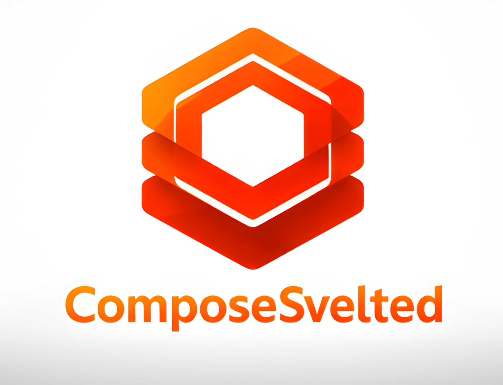

# compose-svelted

<p align="center">
  
</p>

<p align="center">
  <b>Compose-inspired UI framework for Svelte</b><br/>
  Declarative layout · Immutable modifiers · Structural motion · Compose-like navigation
</p>

<p align="center">
  
  
  
</p>

---

## ✨ What is compose-svelted?

**compose-svelted** is an experimental but ambitious UI framework that brings the
**Jetpack Compose mental model** to the Svelte ecosystem.

It is **not** a Material Design clone, and it is **not** a thin component library.

Instead, it focuses on:
- explicit UI composition
- predictable layout
- declarative motion
- navigation as state

All built on top of **Svelte**, without virtual DOM abstractions or hidden magic.

---

## 🧠 Core Philosophy

> UI is a function of state.  
> Layout, motion, and navigation must be explicit and predictable.

Key ideas:
- No implicit behavior
- No global side effects
- No magic context you cannot reason about
- Everything composes

---

## 🧱 Library Structure (High-Level)

### Core V1 – Layout & Styling
- Column, Row, Box
- Modifier (immutable, chainable)
- Shapes
- Theme system
- Typography

### Core V2 – Motion & Navigation (CLOSED)
- AnimatedVisibility
- AnimatedContent
- Declarative motion
- NavController
- NavHost
- Internal backstack

---

## 💪 Strengths

### Explicit Layout
Layouts are predictable and composable.

### Immutable Modifiers
Describe intent, not CSS.

### Structural Motion
Motion is part of the UI structure.

### Compose-like Navigation
Navigation without external routers.

---

## 🚀 Innovation

- Compose mental model on the web
- Navigation as state
- Motion as structure
- No virtual DOM abstraction

---

## 📦 Status

- Alpha
- Core V2 closed
- Core V3 planned

## Project Zones

- `src/lib`: publishable library source.
- `playground`: local app for developing and validating the library against live source changes.
- `src/App.svelte` and `src/samples`: legacy examples, not part of the active library/playground workflow.

## Development Commands

```bash
npm install
npm run dev
npm run build
npm run check
npm run playground:build
```

- `npm run dev`: starts the playground.
- `npm run build`: packages the library into `dist/`.
- `npm run check`: type-checks the playground against the current library source.
- `playground/vite.config.ts` aliases `@danielito1996/compose-svelted` to `src/lib/index.ts`, so playground changes reflect library source immediately.

---

## 🔮 Roadmap

### Core V3
- Nested navigation
- Directional transitions
- Shared elements

---

## ⚠️ CSS Baseline (Required)

Compose Svelted is **layout-deterministic**, assumes a neutral CSS baseline.

You MUST include the following reset in your app:

To avoid layout regressions in existing apps, use one of these two paths:

### Path A (Primary): import baseline from the package

- **Strict baseline** (Compose-like deterministic behavior):

```ts
import "@danielito1996/compose-svelted/baseline.css";
```

- **Safe baseline** (less intrusive for existing projects):

```ts
import "@danielito1996/compose-svelted/baseline-safe.css";
```

Use `baseline-safe.css` if your app already has strong global styles and you want minimal interference.

### Path B (Alternative): do not import baseline, adapt your own `app.css`

If you prefer full control, keep your app stylesheet and ensure at least:

```css
*,
*::before,
*::after {
  box-sizing: border-box;
}

html, body, #app {
  width: 100%;
  height: 100%;
  margin: 0;
  padding: 0;
}
```

To guarantee consistent and predictable behavior of layout components such as
`Box`, `Column`, `Row`, `Surface`, `Scaffold`, and navigation containers,
a **neutral CSS baseline is required** in the host application.

This is **intentional** and mirrors the contract-based approach of **Jetpack Compose**.

### Why this matters

Compose Svelted does **not**:
- force global CSS
- inject layout styles silently
- assume browser defaults

Instead, it expects a minimal, explicit layout contract.
Without this baseline, layout behavior may vary between browsers or projects.

### Tailwind CSS

Compose Svelted **does not require Tailwind CSS**.

Tailwind is used internally as an implementation detail for predictable styling,
but consumers of the library are **not required** to install or configure Tailwind.
