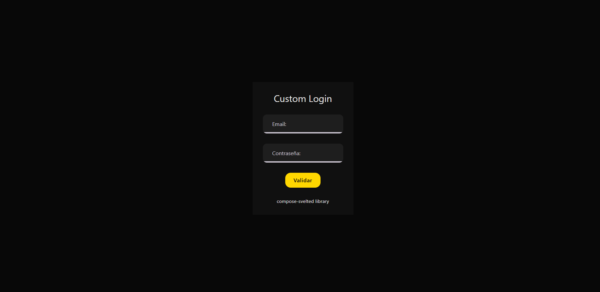

# **COMPOSE-ESVELTED EXAMPLE**

### 👀 Remember

Compose-svelted follow is a JetpackCompose-like svelte library, the components are similar in both.

### Custom Login

<p align="center">
  
</p>

#### Code:

```xml
<!--IMPORTS-->
<Box
    contentAlignment={Alignment.Center}
    modifier={Modifier.fillMaxSize().background(ColorScheme.Background)}
>
    <Surface color={ColorScheme.Surface}>
        <Column
            horizontalAlignment={Alignment.CenterVertically}
            verticalArrangement={Arrangement.spacedBy(20)}
            modifier={Modifier.padding(32)}
        >
            <!-- Header -->
            <Column
                horizontalAlignment={Alignment.CenterVertically}
                verticalArrangement={Arrangement.spacedBy(8)}
            >
                <Text textStyle={TextStyle.HeadlineMedium}>
                    Bienvenido 👋
                </Text>
                <Text textStyle={TextStyle.BodyMedium}>
                    Accede a tu cuenta para continuar
                </Text>
            </Column>

             <!-- Form -->
            <Column
                verticalArrangement={Arrangement.spacedBy(16)}
                modifier={Modifier.fillMaxWidth()}
            >
                <TextField
                    value={name}
                    onValueChange={value => name = value}
                    label="Email"
                />

                <TextField
                    value={pass}
                    onValueChange={value => pass = value}
                    label="Contraseña"
                />
            </Column>

            <!-- Action -->
            <Button modifier={Modifier.fillMaxWidth()}>
                <Row
                    horizontalArrangement={Arrangement.spacedBy(10)}
                    verticalAlignment={Alignment.CenterVertically}
                >
                    <Icon
                        painter="https://cdn.jsdelivr.net/npm/@mdi/svg/svg/login.svg"
                        tint={ColorScheme.OnPrimary}
                        modifier={Modifier.size(18)}
                    />

                    <Text color={ColorScheme.OnPrimary}>
                        Iniciar sesión
                    </Text>
                </Row>
            </Button>

            <!-- Footer -->
            <Text textStyle={TextStyle.BodyMedium}>
                compose-svelted · UI declarativa
            </Text>
        </Column>
    </Surface>
</Box>
```

